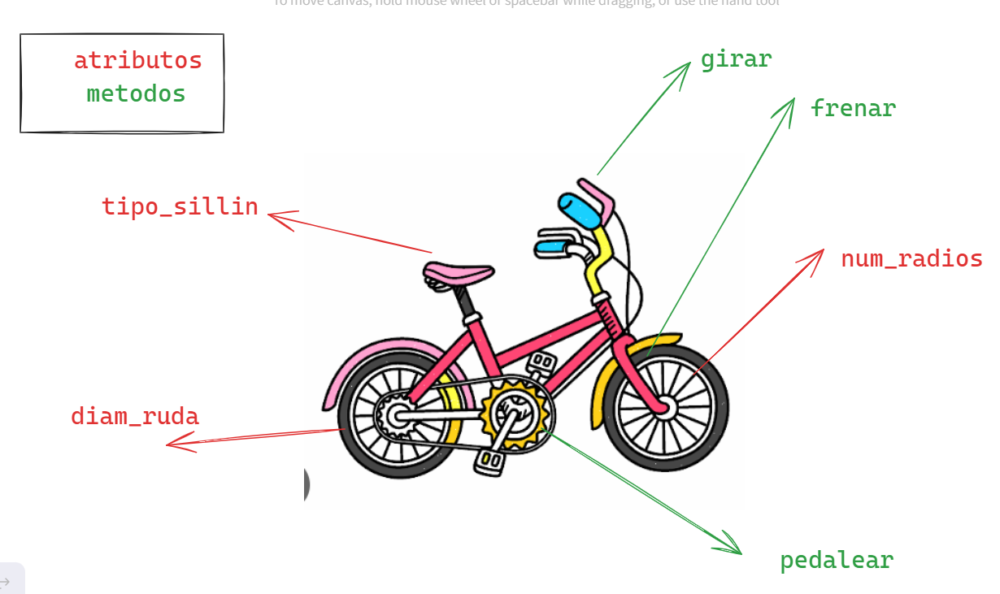

# 🚌POO - PROGRAMACION ORIENTADA A OBJETOS
La programacion orientada a objetos - `POO` o en sus siglas en ingles `OOP`, es una manera de programar (pardigmas), que permite llevar al codigo mecanismos usados con entidad de la vida real.

**Sus beneficion son los siguientes:**
1. **Encapsulamiento:** Permite `empaquetar` el codigo dentro de una unidad (objeto) donde se puede terminar el ambito de actuacion.
2. **Abstraccion:** Permite `generalizar` los tipos de objetos a traves de las clases y simplificar el programa.
3. **Herencia:** Permite `reutilizar` codigo al poder heredar atributos y comportamientos de una clase.
4. **Polimorfismo:** Permite `crear` multiples objetos a partir de una misma pieza flexible de codigo.

   Existen dos que a nivel educativos no es necesario aprenderlo.

5. **Acoplamiento:**
6. **Cohesion:**

## ¿QUE ES UN OBJETO?
Un `objeto` es un tipo de dato estructurado que contiene o almacena `datos` y `codigo`.

|Elemetos|Que son  |Como se llama|Como se identifica  |
|--------|---------|-------------|--------------------|
|Dato    |Variables|  Atributos  |Mediante Sustantivos|
|Codigo  |Funcion  |Metodo       |Mediantes Verbos    |

 Un objeto representa una `instnacia unica` de alguna `entidad` a traves de sus atributos e interactua con otros objetos o con si mismo a traves de sus metodos.

## ¿QUE ES UNA CLASE?
Para crear un `objeto` promero debemos definir la `clase`.
La clase es como el `molde` con el que se crean nuevos objetos.
Es el proceso de diseño de una clase hay que tener en cuenta el `principio de responsabilidad unica`, esto intentando que los `atributos` y los `metodos` esten enfocados en un objetivo unico y bien definido.

> [!TIP]
>  Un paradigma de programacion es un metodo, tecnica o estilo de programar. Muchos de los lenguajes de programacion son creados base  un paradigma, ejemplo java es un lenguaje que adopta el paradigma POO(Programacion Orientada a Objetos). Sin embargo existen lenguajes de programcion que adoptan varios paradigmas como es el caso de python y javascript estos son lenguajes de multiparadigmas.
